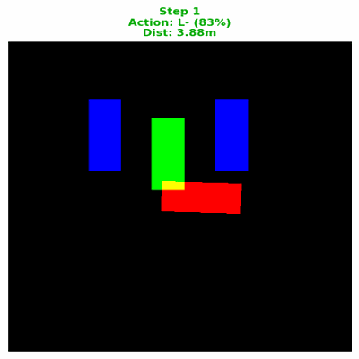
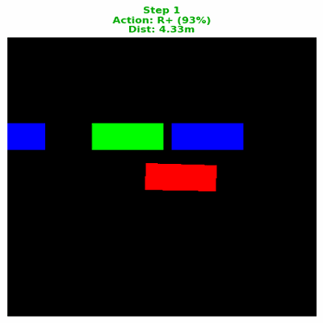
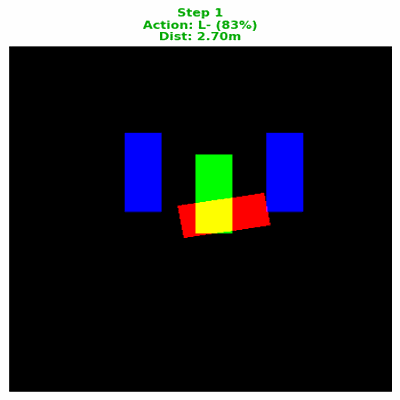

# Parking IL Planner

[English](README.md)

这是一个基于模仿学习的自动泊车运动规划研究项目。系统先用 Reeds-Shepp
专家规划器在合成泊车场景中生成七类离散动作示范，再训练 ResNet + Transformer
模型，根据三通道占据栅格、相对目标状态和近期动作历史预测下一步动作。

仓库公开算法和可复现流程，不提交大规模样本、模型权重及批量评估图片。

## 核心问题

逐帧动作分类准确率并不等于闭环泊车成功率。模型一旦预测错误，下一帧输入分布
就会改变，误差可能持续累积。因此本项目严格区分开环分类评估与闭环驾驶评估，
并保留 DAgger 等未达到预期的实验与限制说明。

## 闭环泊车效果

以下是历史评估中筛选出的纯神经网络控制器闭环 rollout。红色表示自车，绿色表示
目标位姿，蓝色表示障碍物。

| 垂直泊入 · 场景 38555 | 水平泊入 · 场景 38740 | 极限初始位置垂直泊入 · 场景 30348 |
|:---:|:---:|:---:|
|  |  |  |

这些动图用于定性展示，不代表整体成功率。定量结果必须遵守
[评估协议](docs/evaluation-protocol.md)中的统计口径。

## 快速开始

```bash
python -m venv .venv
source .venv/bin/activate
pip install -e ".[ml]"

# 不需要数据集或权重的专家规划器验证
parking-il expert-demo

# 生成本地小型样本，输出默认被 Git 忽略
parking-il generate --trajectories 20 --output data/generated/demo
```

CLI 默认最多渲染 128 个样本（约 54 MiB）。这些数据只用于验证流程，不能训练出
有实际效果的模型。完整步骤见
[复现说明](docs/reproduction.md)。

## 数据边界

- `data/generated/`：生成样本，不提交
- `checkpoints/`：模型权重，不提交
- `artifacts/`：评估结果，不提交
- `assets/`：仅存放少量经过筛选的公开演示素材

## 安全声明

这是研究代码，不是量产车辆控制器。当前实现没有覆盖传感器噪声、执行器延迟、
动态障碍物、定位误差及车型安全约束。未经独立安全架构和充分验证，不得直接用于
真实车辆控制。

项目采用 Apache-2.0 许可证。Reeds-Shepp 部分基于 MIT 许可的 PythonRobotics
实现改编，归属信息见 [NOTICE](NOTICE)。
